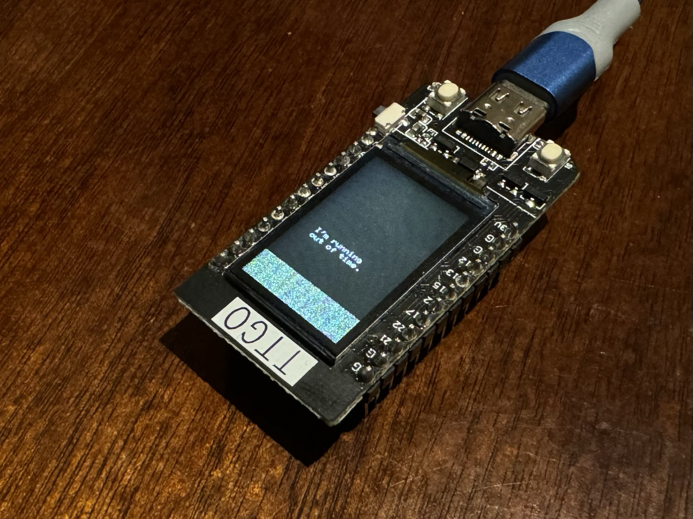

layout: page
title: "Module1"
permalink: /Module-1

## Module 1:

As a senior, I have found myself repeatedly grappling with the relentless passage of time and the looming pressure to accomplish "big things". This project serves as a reflection of that experience, capturing the anxieties and uncertainties inherent in the pursuit of academic and creative endeavors.

### Specialization for the Space
The TFT display allowed me to create an immersive visual experience tailored to the viewer's environment. 

The bottom portion of the display was broken, disrupting the seamless flow of visual narrative. I tried to embrace this imperfection as a metaphor for the fractured nature of human experience.

Incorporating the hanging structure into the metaphor, the piece almost becomes a symbol of navigating the currents of time and space. As the device twists and twirls, it invites viewers to reflect on the fluidity of existence and the transient nature of our journey through life.s

### Creative Decisions
As students, we oscillate between moments of reassurance and moments of doubt, caught in a perpetual cycle of striving and questioning.

Central to this endeavor was the deliberate allocation of time within the 24-second loop.

The loop's structure serves as a microcosm of life's temporal constraints and emotional fluctuations. 60% of the time is dedicated to plastering the words "It'll be okay" across the screen, represting a student's attempt at calming themselves. But these messages are repeatedly interrupted by anxiety-riddled messages that ultimately take up 20% of the 24-second loop. 

Only 10% of the loop is dedicated to respite (the ESP goes to sleep) from the constant ebb and flow of stress, underscoring the fleeting nature of solace.

This intentional imbalance mirrors the internal struggles of many students who are navigating the tumultuous currents of academic and personal life. 

There's a poignant risk embedded within the design—an imbalance in energy expenditure that will ultiimately cause the ESP to run out of battery before the display is taken down.

The disproportionate allocation of energy toward anxiety and attempts at reassurance serves as a metaphor for the delicate balance between emotional resilience and vulnerability. 

It's a stark reminder of the finite resources at our disposal and the importance of mindful energy management in navigating life's challenges.

Color was also an important consideration. In contrast to the vibrant nature of the calming messages, the anxiety-inducing phrases are deliberately presented in black and white. This choice reflects the starkness and clarity with which anxiety can sometimes manifest in our lives, devoid of the colorful nuances that characterize moments of comfort and reassurance.

The positioning of the anxiety segment towards the bottom right corner of the display was also a strategic decision aimed at reinforcing its thematic significance. Placing it in this location serves as a visual metaphor for the creeping presence of anxiety, lurking at the periphery of our consciousness and gradually encroaching upon our thoughts and emotions.

### Technical Issues Encountered
Developing this generative art project was not without its challenges. Configuring the TFT display and managing its backlight intensity required careful calibration and experimentation. Synchronizing the display of messages with precise timing posed additional technical hurdles, necessitating thorough testing and refinement.

### Addressing Common Technical Issues
I encountered several technical challenges that required innovative solutions. 

The most notable issue was getting the ESP to show up my Arduino IDE, which proved to be a significant roadblock in the initial stages of the project.

After some digging, I stumbled upon a tutorial on [YouTube](https://www.youtube.com/watch?v=b8254--ibmM), which provided invaluable insights into resolving the issue.

It's also crucial to have a good USBC connection, and it may help to have [this driver](https://www.silabs.com/developers/usb-to-uart-bridge-vcp-drivers?tab=downloads) installed. 

## README
This project creates a generative art display using an ESP32 microcontroller and a TFT display. The display alternates between soothing messages and anxiety-inducing phrases, reflecting the ebb and flow of human emotion within a 24-second loop.

### Installation
To replicate this project, follow these steps:

1. Install the Arduino IDE from the official website.
2. Install the ESP32 board support package in the Arduino IDE. Follow the instructions [here](https://youtu.be/adLUgmCJKnM).
3. Install the TFT_eSPI library by Bodmer. Go to Sketch > Include Library > Manage Libraries..., search for "TFT_eSPI" and install it.
4. Connect your ESP32 board to your computer via USB.
5. Open the code provided in the Arduino IDE.
6. Upload the code to your ESP32 board.

### Usage
After uploading the code, the generative art display will start running immediately. The display alternates between soothing messages, displayed in random colors, and anxiety-inducing phrases, displayed in black and white towards the bottom right corner of the screen.

The display operates within a 24-second loop, with 60% of the time dedicated to soothing messages, 20% to anxiety-inducing phrases, and 10% to deep sleep mode to conserve power.

### Troubleshooting
If you encounter any issues during installation or usage, refer to the following resources:

For troubleshooting ESP32 board recognition in Arduino IDE, watch [this](https://www.youtube.com/watch?v=b8254--ibmM) tutorial.

If you're still having trouble, check your USB connection, and try downloading the [device driver](https://www.silabs.com/developers/usb-to-uart-bridge-vcp-drivers?tab=downloads) for your OS and restart your machine.